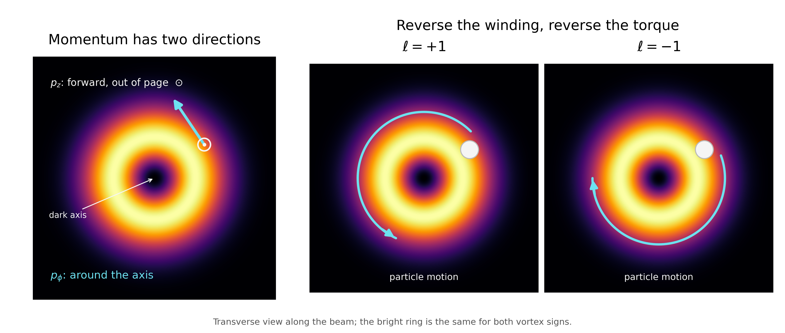

# Why Doesn't a Laser Beam Lose Its Shape?

### Propagating light easily loses its shape, turning everything into a blur — yet laser beams seem to survive. Finding out how this can be leads to discovering a whole family of beams — and a surprising twist at the end.

> Caption: **A helical wavefront — light with a twist.**
> Alt text: A monochrome 3D rendering of a helical optical wavefront twisting around the direction of propagation, illustrating the spiral phase structure of light carrying orbital angular momentum.
> Source: Image by author.

Send light through an opening of almost any shape — a keyhole, a slit, a square — and diffraction soon blurs that shape into a formless smear. Yet a laser beam can retain its shape while propagating: its bright spot can travel for kilometres and still look almost exactly as it started. How can that be?

It turns out that the familiar shape of a laser beam is a special solution of the paraxial wave equation. The beam expands as it travels, but its shape remains the same. The surprise is that it is not the only one: there is an entire family of beam shapes with this property.

And some of these beams have an even stranger feature. Not all of their momentum points forward — part of it points sideways. That transverse momentum can circulate around the beam axis, giving the light orbital angular momentum. The effect is small, but very real: light can use it to make matter rotate.

## Diffraction Destroys Shapes — Yet a Gaussian Survives

Consider a beam that travels in the *z* direction and, for simplicity, has an amplitude *u* that varies only along *x* -superscript 1-. For beams like this — travelling mainly in one direction — the full wave equation simplifies to the **paraxial wave equation**:

$$
i \frac{\partial u}{\partial z}
=
-\frac{1}{2k}\frac{\partial^2 u}{\partial x^2}.
$$

The second derivative in the transverse direction (*x*) drives the evolution in *z*, so sharp edges and narrow features change rapidly as the beam propagates. Diffraction immediately reshapes a slit, a hard edge, or almost any other profile.

Some profiles are different. Suppose we try a Gaussian shape:

$$
u(x,z)=\frac{1}{\sqrt{w(z)}}
e^{-x^2/w(z)^2}
e^{ikx^2/2R(z)}
e^{-i\psi(z)/2}.
$$

When we put this shape into the wave equation, we find that it is an exact solution. The beam has a Gaussian intensity profile — the familiar bell-curve shape. Its width *w(z)* changes as the wave propagates, but the Gaussian shape itself does not. The beam also has a curved wavefront, with radius *R(z)*, while *ψ(z)* represents a phase shift that builds up during propagation, known as the **Gouy phase**.

This raises the obvious question: is the Gaussian the only shape that survives diffraction?

> Caption: **Figure 1. Not every beam keeps its shape. After 5 m of free-space propagation, a hard-edged circular beam develops diffraction rings, while a Gaussian beam simply broadens while retaining its Gaussian profile. Both beams were propagated using the same angular-spectrum calculation.**
> Alt text: Four-panel comparison of a hard-edged circular beam and a Gaussian beam before and after 5 m of propagation. The circular beam spreads into a broad central spot surrounded by diffraction rings, while the Gaussian beam becomes wider but retains its smooth Gaussian shape.
> Source: Image by author.

## Some Shapes Are Made to Propagate

To find out whether there are more shapes that keep their form during propagation, we look for solutions that combine the Gaussian envelope from the previous section with a polynomial *H*(ξ) and an additional phase factor e⁻ⁱⁿψ⁽ᶻ⁾. We use ξ as a scaled transverse coordinate,

$$
\xi=\sqrt{2}\,\frac{x}{w(z)}.
$$

When we put this form into the paraxial wave equation, the *z*-dependence separates out. What remains is a differential equation for *H*(ξ):

$$
H''(\xi)-2\xi H'(\xi)+2nH(\xi)=0.
$$

This is a well-known equation, the Hermite equation. Its polynomial solutions exist only when *n* is a non-negative integer, *n* = 0, 1, 2, …, giving the Hermite polynomials Hₙ(ξ). The corresponding one-dimensional modes are

$$
u_n(x,z)\propto
\frac{1}{\sqrt{w(z)}}
e^{-\xi^2/2}
H_n(\xi)
e^{ikx^2/2R(z)}
e^{-i\left(n+\tfrac{1}{2}\right)\psi(z)}.
$$

For *n* = 0 we get the ordinary Gaussian we have seen before. For *n* = 1, 2, 3, …, extra nodes and lobes appear, but the rescaled shape is still preserved during propagation. These are the one-dimensional Hermite–Gaussian modes. The Gaussian is not one special survivor; it is the first member of a whole family.

> **All light beams undergo diffraction. But some beams keep their shape while doing so.**

The integer *n* may look suspiciously quantum-mechanical, but there is nothing quantum here. It appears because the differential equation and boundary conditions allow only a discrete family of solutions — much as a guitar string supports only certain standing-wave patterns.

There is, however, a familiar quantum system governed by exactly the same Hermite equation: the harmonic oscillator [1]. There, *n* labels discrete energy levels. Here, it labels transverse beam shapes.

The mathematics is the same; the physical meaning is different.

> Caption: **Figure 2. Gaussian beams come in families. The Hermite–Gaussian modes are labelled by two integers, n and m, which count the transverse structure in the horizontal and vertical directions. The familiar Gaussian beam is the lowest member, HG₀₀.**
> Alt text: Four-by-four grid showing the intensity profiles of Hermite–Gaussian laser modes for n and m from 0 to 3. HG00 is a single bright Gaussian spot; increasing n divides the beam into more vertical lobes, while increasing m produces more horizontal lobes.
> Source: Image by author.

## Two Different Beams Can Propagate in Exactly the Same Way

Now consider a field *u*(*x*, *y*, *z*) that varies in both *x* and *y*. Since the paraxial equation does not mix the two transverse directions, we can solve them separately and multiply the two one-dimensional modes:

$$
u_{n,m}(x,y,z)=u_n(x,z)\,u_m(y,z).
$$

Its Gouy phase is (*n* + *m* + 1) *ψ*(*z*). Only the sum *n* + *m* matters. Two beams with different shapes but the same *n* + *m* therefore accumulate the same phase as they propagate, so a fixed combination of them remains a fixed combination.

The simplest example is *n* + *m* = 1: HG₁₀ and HG₀₁, one lobed along *x* and the other along *y*. Adding or subtracting them does not create a fundamentally new beam. It simply rotates the same two-lobed pattern by 45°.

But instead of only adding or subtracting the two modes, we can give one of them a phase shift before combining them. For example, give them a quarter-cycle, or π/2, phase difference:

$$
\text{HG}_{10}+i\,\text{HG}_{01}.
$$

Now the beam no longer looks like a rotated two-lobed mode. Its intensity becomes a doughnut. More importantly, something interesting happens to the phase: instead of jumping across a node, it winds smoothly around the dark centre. These vortex modes are usually described as Laguerre–Gaussian (LG) modes; we will simply call them doughnut or vortex beams here.

> Caption: **Figure 3. From two lobes to a vortex. HG₁₀ and HG₀₁ can be combined in different ways. Adding or subtracting them produces the same two-lobed pattern at a rotated angle. Add a quarter-cycle (π/2) phase shift between them instead, and the intensity becomes a doughnut. The two doughnuts look identical here—but their hidden phases wind in opposite directions.**

> Alt text: Six intensity plots arranged in two rows and three columns. The first column shows the perpendicular two-lobed HG10 and HG01 modes. Adding and subtracting them produces diagonally rotated two-lobed patterns. Combining them with positive or negative pi-over-two relative phase produces identical doughnut-shaped intensity patterns with a dark centre.

> Source: Image by author.

## The Doughnut Is Hiding a Twist

The doughnut-shaped intensity is easy to see, but it isn't the interesting part — a ring of light, by itself, is just a shape like any other. The interesting part is hidden in the phase.

Walk once around the beam axis and the phase completes a full turn of 2π. Follow a surface of constant phase as you also move forward in *z*, and that surface traces a helix around the beam axis. Unlike the earlier combinations of HG₁₀ and HG₀₁, the doughnut has a phase that winds smoothly and continuously around the axis. Depending on whether the relative phase shift is +π/2 or −π/2, the helix winds in one direction or the other.

More generally, vortex modes can wind ℓ times around the axis, with a phase factor *e*ⁱℓφ. Our example has ℓ = +1 or −1, depending on which quarter-cycle phase shift we choose. We can build the higher-order versions of these vortices from higher-order HG modes with *n* + *m* = 2, 3, 4, …. We should only combine modes with the same value of *n* + *m*: otherwise the components accumulate different Gouy phases during propagation, and the combined shape will not remain fixed. For the single-ring vortices we consider here, the magnitude of the winding number is

|ℓ| = *n* + *m*.

The sign of ℓ determines the direction in which the phase helix winds.

> **The doughnut is what we see in the light intensity. The twist is hidden in the phase.**

## Mode Conversion in Experiments

This isn't just algebra — the conversion can be done for real. Take a Hermite–Gaussian beam oriented at 45° through a pair of cylindrical lenses. In the lenses' own frame, that diagonal mode is  the in-phase combination of the horizontal and vertical modes. The lenses focus the beam differently along their two axes, so the horizontal and vertical components pick up different Gouy phases. Choose the lens spacing and beam parameters so that the difference is a quarter cycle, and the output becomes HG₁₀ + i HG₀₁ — the combination that produces the doughnut.

This mode converter was built and demonstrated in 1993 by Beijersbergen and colleagues in Leiden [2]. A diagonally oriented two-lobed beam goes in at one side, and a vortex comes out at the other.

> Caption: **Figure 4. Turning lobes into a vortex. A pair of cylindrical lenses converts a Hermite–Gaussian mode, oriented at 45° to the lens axes, into a vortex mode. The lenses focus the beam differently along the two transverse directions, introducing the relative phase shift that turns the two-lobed input into a doughnut-shaped output.**
> Alt text: 3D illustration of a laser beam passing through two transparent cylindrical lenses. The input beam has two bright diagonal lobes, while the output has a bright doughnut-shaped intensity profile. The beam narrows asymmetrically between the lenses, illustrating the astigmatic mode conversion.
> Source: Image by author.

## Some of Light's Momentum Points Sideways

We know that light carries momentum: when a beam is absorbed or reflected, it pushes on whatever absorbs or reflects it. For a plane wave that momentum points entirely along the direction of propagation. The push is purely forwards.

For a structured beam, the wavefront is not everywhere perpendicular to the beam axis, and the forward component of the momentum is reduced. This means that there is also sideways, or transverse, momentum. For most beams this transverse momentum averages to zero over the full beam.

A vortex beam is special in how this transverse momentum is arranged. It has an azimuthal component: locally, the momentum circulates around the axis.

The sideways linear momentum still cancels when we add contributions from opposite sides of the beam, so the beam gives no net push to the left or right. The torques, however, point in the same rotational direction and therefore add. That is orbital angular momentum: momentum that circulates around the beam axis rather than pointing only along it.

> Caption: **Figure 5. A twist with mechanical consequences. A vortex beam carries momentum forward and around its axis. Its azimuthal momentum can transfer angular momentum to a trapped particle; reversing the phase winding reverses the direction of rotation.**
> Alt text: Three transverse views of a doughnut-shaped vortex beam. The first marks forward momentum out of the page and azimuthal momentum around the dark axis. The other two show particles on identical bright rings moving in opposite directions for phase winding numbers +1 and −1.
> Source: Image by author.

## Light Can Actually Make Matter Rotate

We know that angular momentum is a conserved quantity — it can't come from nowhere, and cannot disappear into nowhere. Think back to the mode converter: a beam with zero orbital angular momentum goes in, and a beam carrying orbital angular momentum comes out. Where did it come from?

It has to come from the lenses. There's no other source. If the light picks up clockwise orbital angular momentum on the way through, the lens system has to recoil counterclockwise — a real, physical kick, exactly as much as the light gained.

This wasn't obvious in 1992. The Leiden team that first demonstrated the mode conversion were also the ones who first worked out that a light beam's spatial structure alone carries angular momentum [3]. They took up the challenge of actually measuring it. Robert Spreeuw, one of the four, later wrote a personal account of what came next [4]. They hung a pair of cylindrical lenses on a torsion fibre in vacuum and sent a vortex beam through, looking for the tiny twist produced by the reaction torque. It turned out to be "prohibitively difficult," in Spreeuw's own words. The signal was buried under systematic noise they could not resolve. In this case the physics was right, but the experiment never produced a clean enough signal.

The experimental demonstration came not much later, from somewhere else. In 1995, He, Friese, Heckenberg and Rubinsztein-Dunlop skipped the torsion pendulum and went straight for a particle sitting in the beam itself [5]. Small absorbing particles illuminated by a vortex beam started to rotate. When they reversed the vortex's handedness, the particles reversed their rotation too. Orbital angular momentum is not just a theory — a doughnut beam can actually make a particle rotate.

> **Orbital angular momentum is not just a theory — a doughnut beam can actually make a particle rotate.**

We started with beam shapes that survive diffraction, and ended with a beam that can transfer angular momentum to matter. And none of it needed a single photon. Our description of structured light so far has been fully classical.

The next question is different: what changes when we actually apply quantum mechanics to the light itself? How do these modes, and this angular momentum, look in a theory where photons rule?

That is where the next post begins.

## Bonus

As extra (just because we can) a picture of a higher order doughnut build from third-order HG beams. 

> Caption: **Bonus figure — Building a higher-order vortex. A third-order vortex can be constructed from four degenerate Hermite–Gaussian modes with carefully chosen amplitudes and phases. Although the resulting intensity is still a simple doughnut, its hidden phase winds three times around the dark centre — a total phase change of 6π.**
> Alt text: Four third-order Hermite–Gaussian intensity patterns, labelled HG₃₀, i√3 HG₂₁, −√3 HG₁₂, and −i HG₀₃, combine into a higher-order vortex mode. The resulting mode has a bright circular ring surrounding a dark centre.
> Source: Image by author.

## References

[1] G. Nienhuis and L. Allen, "Paraxial wave optics and harmonic oscillators," *Phys. Rev. A* **48**, 656–665 (1993). https://doi.org/10.1103/PhysRevA.48.656

[2] M. W. Beijersbergen, L. Allen, H. E. L. O. van der Veen, and J. P. Woerdman, "Astigmatic laser mode converters and transfer of orbital angular momentum," *Opt. Commun.* **96**, 123–132 (1993). https://doi.org/10.1016/0030-4018(93)90535-D

[3] L. Allen, M. W. Beijersbergen, R. J. C. Spreeuw, and J. P. Woerdman, "Orbital angular momentum of light and the transformation of Laguerre-Gaussian laser modes," *Phys. Rev. A* **45**, 8185–8189 (1992). https://doi.org/10.1103/PhysRevA.45.8185

[4] R. J. C. Spreeuw, "Spiraling light: from donut modes to a Magnus effect analogy," *Nanophotonics* **11**, 633–644 (2021). https://doi.org/10.1515/nanoph-2021-0458

[5] H. He, M. E. J. Friese, N. R. Heckenberg, and H. Rubinsztein-Dunlop, "Direct observation of transfer of angular momentum to absorptive particles from a laser beam with a phase singularity," *Phys. Rev. Lett.* **75**, 826–829 (1995). https://doi.org/10.1103/PhysRevLett.75.826

superscript 1. An informed reader can wonder what the impact of polarization is. The article considers linearly polarized light and optical components that do not affect this polarization. If we include the option of circular polarization there is yet another source of angular momentum, but that is better discussed in a separate article.