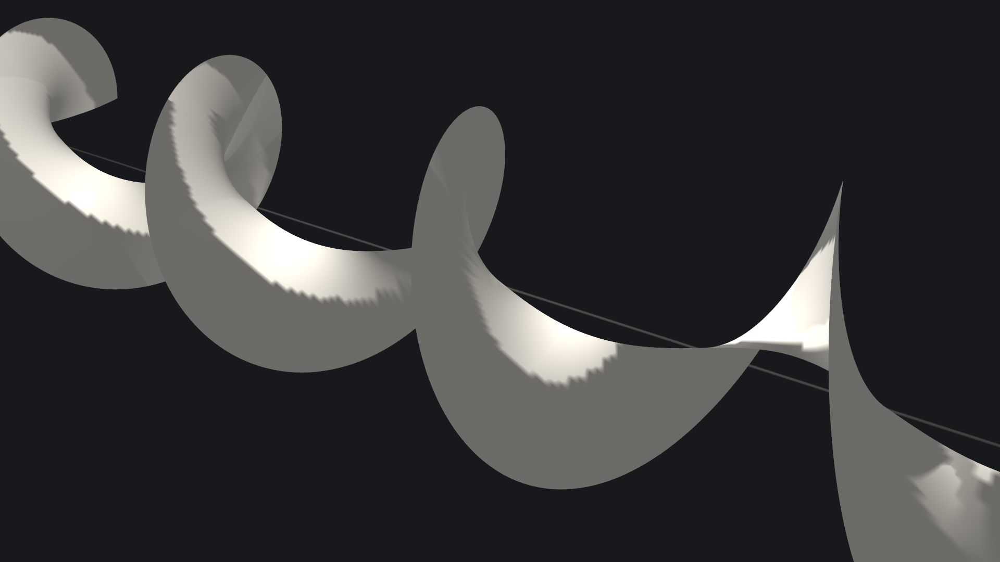
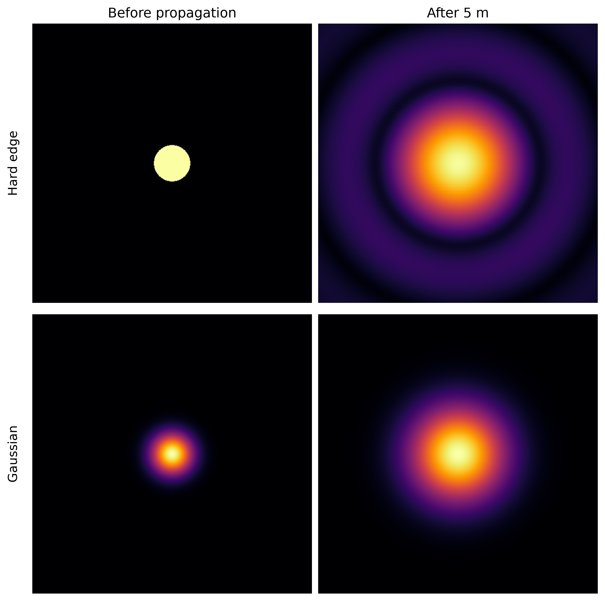
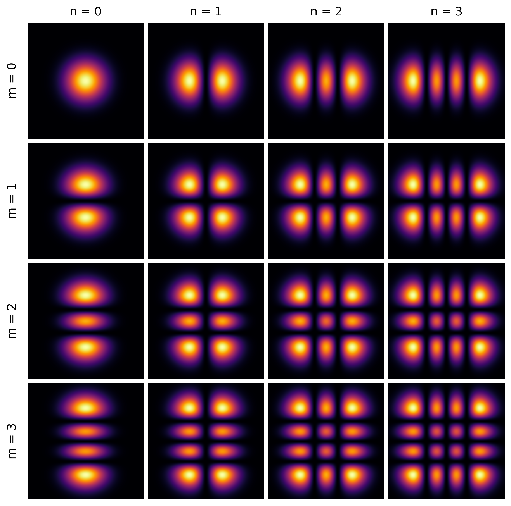
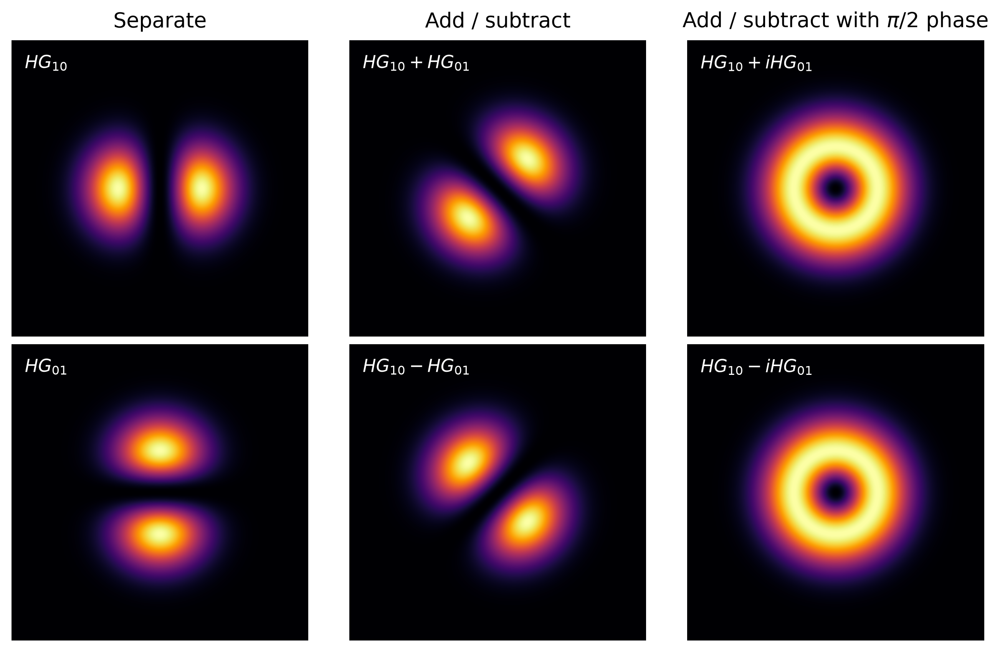
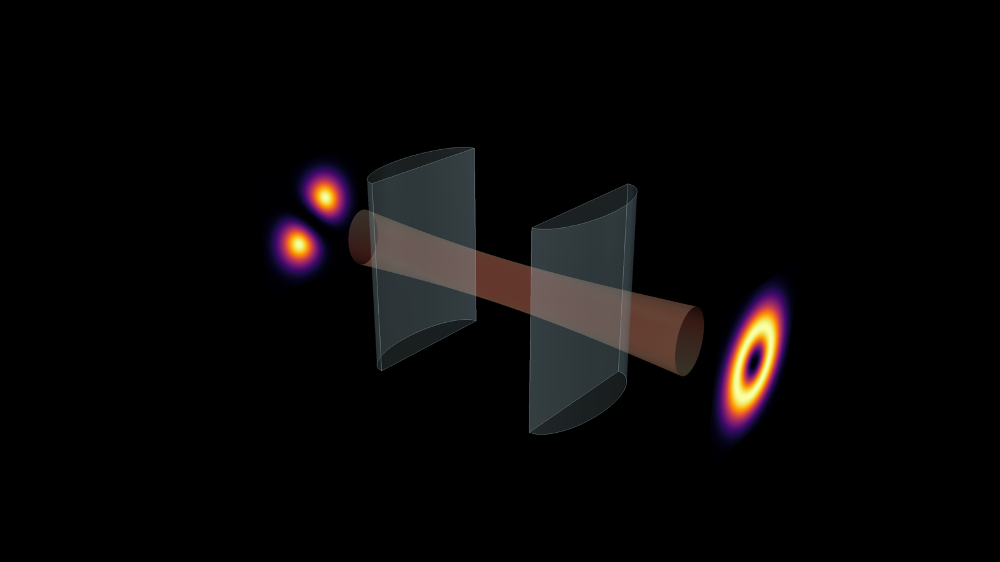
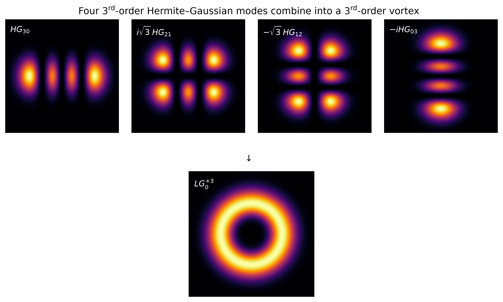

# Why Doesn't a Laser Beam Lose Its Shape?

*Shine light through an opening of any shape and diffraction smears it into a blob. Laser beams somehow survive intact — and figuring out how leads straight to a surprising twist.*


> Caption: **A helical wavefront — light with a twist.**
> Alt text: A monochrome 3D rendering of a helical optical wavefront twisting around the direction of propagation, illustrating the spiral phase structure of light carrying orbital angular momentum.

```{=html}
<!--
POST 1 STORY ARC

A hole diffracts → a Gaussian propagates as a mode → Gaussian beams come in whole
families → two apparently different mode families are closely related → an LG mode
has a helical phase → that phase means azimuthal momentum and orbital angular
momentum → the angular momentum can physically act on matter.

Keep this post classical. The harmonic-oscillator connection can foreshadow Post 2,
but quantization belongs there.
-->
```

Light seems able to take on any shape you shine it through — a keyhole, a leaf, a nebula. In reality none of those shapes should survive: send light through an opening of any form and diffraction blurs it into a formless smear within meters. Yet a laser beam refuses to do this — its bright spot travels for kilometers and comes out looking almost exactly as it started. How can that be?

It turns out there are some beam shapes that have this property: they may grow as they travel, but they keep their shape. Look closer, and some of these beams carry momentum sideways, circling the axis instead of pointing straight ahead. That sideways momentum is orbital angular momentum — real enough to make an object rotate.
## Diffraction Destroys Shapes — Yet a Gaussian Survives

Consider a beam that travels in the *z* direction and has an amplitude only in *x* direction for simplicity. Once launched, its transverse profile evolves according to one equation — the paraxial wave equation,

$$i \frac{\partial u}{\partial z} = -\frac{1}{2k} \frac{\partial^2 u}{\partial x^2}$$

— which says how the shape *u(x)* at one distance determines the shape at the next. Crucially, u depends on z: whatever profile you start with, this equation reshapes it as it travels. A sharp feature — a narrow slit, a hard edge — corresponds to rapid variation in x, and rapid variation is exactly what the second-derivative term acts on most strongly. So a shape that starts out crisp does not, in general, stay crisp; the equation itself is a rule for how much a profile *must* change with z, not whether it does.

A Gaussian avoids this fate, and the equation shows why directly. Try

$$u(x,z) = \frac{1}{\sqrt{w(z)}} \exp\left[-\frac{x^2}{w(z)^2}\right] \exp[iφ(z)]$$

as an ansatz, and it satisfies the equation exactly — the only z-dependence needed is in the width w(z) and an overall phase φ(z); the underlying shape, "Gaussian," never changes. There's no residual term forcing the profile to distort into something else. The beam widens, but it does so by stretching the same curve, not by growing new structure. A laser beam's spot isn't a fixed picture being carried along and gradually blurred — it's one of the rare shapes the equation lets pass through essentially untouched, which raises the natural question: is it the only one?


> Caption: **Figure 1. Not every beam keeps its shape. After 5 m of free-space propagation, a hard-edged circular beam develops diffraction rings, while a Gaussian beam simply broadens while retaining its Gaussian profile. Both beams were propagated using the same angular-spectrum calculation. Image by author.**
> Alt-text: Four-panel comparison of a hard-edged circular beam and a Gaussian beam before and after 5 m of propagation. The circular beam spreads into a broad central spot surrounded by diffraction rings, while the Gaussian beam becomes wider but retains its smooth Gaussian shape.

## Some Shapes Are Made to Propagate

The Gaussian is not a special exception — it is only the simplest member of a family. Try a more general version of the same ansatz, keeping the same width w(z) and radius of curvature but replacing the fixed Gaussian bump with some other transverse shape h(ξ), written in the rescaled coordinate ξ = √2 x/w(z):

$$u_n(x,z) = \frac{1}{\sqrt{w(z)}} \exp\left[\frac{ikx^2}{2R(z)}\right] \exp[-i(n+\tfrac{1}{2})ψ(z)]\, h(ξ)$$

Substitute this into the paraxial equation, and almost everything from before goes through unchanged — the same w(z), the same curvature R(z). What's left over is a single condition that h(ξ) alone must satisfy, with all the z-dependence cancelled out:

$$h''(ξ) - 2ξ\,h'(ξ) + 2n\,h(ξ) = 0$$

This equation only has solutions that stay finite, rather than blowing up as ξ grows, when n is a non-negative integer: 0, 1, 2, … Each integer picks out one particular shape hₙ(ξ) — a Gaussian multiplied by a polynomial with n nodes. n = 0 recovers the plain Gaussian from before. n = 1, 2, 3, … are new shapes, each with its own pattern of lobes, and each one just as immune to diffraction's usual smoothing as the Gaussian was. The equation doesn't hand us one lucky survivor — it hands us an entire ladder of them.

This equation only has solutions that stay finite, rather than blowing up as ξ grows, when n is a non-negative integer: 0, 1, 2, … Each integer picks out one particular shape hₙ(ξ) — a Gaussian multiplied by a polynomial with n nodes. n = 0 recovers the plain Gaussian from before. n = 1, 2, 3, … are new shapes, each with its own pattern of lobes, and each one just as immune to diffraction's usual smoothing as the Gaussian was. The equation doesn't hand us one lucky survivor — it hands us an entire ladder of them.

This kind of quantization is nothing exotic — it's the same reason a guitar string only rings at certain frequencies: a differential equation plus a boundary condition (stay finite, don't blow up) forces a continuous problem to admit only a discrete set of solutions. No energy levels, no ℏ, nothing quantum required.

The genuinely striking part is that the same equation reappears with a different meaning in quantum mechanics. The Schrödinger equation for a two-dimensional harmonic oscillator has identical mathematical form — but there, the roles are different: it governs a wavefunction evolving in time, and the integer n labels discrete energy. Our beam equation governs a field's shape evolving in space (z stands in for t), and n labels discrete transverse shapes, not discrete energies — a beam of order n can carry any energy at all; nothing here restricts it. Same math, two completely different physical quantities being quantized, for two completely different physical reasons.


> Caption: **Figure 2. Gaussian beams come in families. The Hermite–Gaussian modes are labelled by two integers, n and m, which count the transverse structure in the horizontal and vertical directions. The familiar Gaussian beam is simply the lowest member, HG₀₀. Image by author.**
> Alt text: Four-by-four grid showing the intensity profiles of Hermite–Gaussian laser modes for n and m from 0 to 3. HG00 is a single bright Gaussian spot; increasing n divides the beam into more vertical lobes, while increasing m produces more horizontal lobes.

## Two Different Beams Can Propagate in Exactly the Same Way

Now imagine a real beam, varying in both x and y. Since the paraxial equation has no term mixing the two directions, a product of two of the 1D shapes found earlier,

$$u_{n,m}(x,y,z) = χ_n(x)\,χ_m(y)$$

is itself an exact solution — solve x and y separately, then just multiply. Its Gouy phase is $(n+m+1)ψ(z)$, and only the *sum* n+m enters, not n and m individually. That single fact is the key to everything that follows: two beams with different shapes but the same n+m accumulate identical phase as they propagate, so their relative phase never drifts — any combination fixed at the waist stays fixed forever.

Take the simplest pair with n+m=1: TEM₁₀ and TEM₀₁, one lobed along x, the other along y. Add and subtract them, and the result is unsurprising — the same two-lobed pattern, just rotated by 45°. Recombining real modes with real coefficients only ever rotates the picture; it can't do anything more interesting, because both ingredients are already real, node-and-lobe patterns.

But nothing forces the coefficient to be real. Combine them with a *quarter-cycle phase* instead of a sign —

$$\text{HG}_{10} + i\,\text{HG}_{01}$$

— and the result stops looking like a rotated version of anything you started with. The intensity turns into a doughnut, and buried in that combination is a phase that winds smoothly around the dark centre, rather than flipping sign across a node the way every real combination did.


> Caption: **Figure 3. From two lobes to a vortex. HG₁₀ and HG₀₁ can be combined in different ways. Adding or subtracting them produces the same two-lobed pattern at a rotated angle. Add a quarter-cycle (π/2) phase shift between them instead, and the intensity becomes a doughnut. The two doughnuts look identical here—but their hidden phases wind in opposite directions. Image by author.**
> Alt text: Six intensity plots arranged in two rows and three columns. The first column shows the perpendicular two-lobed HG10 and HG01 modes. Adding and subtracting them produces diagonally rotated two-lobed patterns. Combining them with positive or negative pi-over-two relative phase produces identical doughnut-shaped intensity patterns with a dark centre.

## The Doughnut Is Hiding a Twist

## The Doughnut Is Hiding a Twist

The doughnut-shaped intensity is easy to see, but it isn't the interesting part — a ring of light, by itself, is just a shape like any other. The interesting part is hidden in the phase.

Write $\text{HG}_{10} + i\,\text{HG}_{01}$ in polar coordinates, $x = ρ\cosφ$, $y = ρ\sinφ$. Since $\text{HG}_{10}\propto x$ and $\text{HG}_{01}\propto y$ (times the same radial envelope),

$$\text{HG}_{10} + i\,\text{HG}_{01} \;\propto\; (x+iy)\cdot(\text{envelope}) \;=\; ρ\,e^{iφ}\cdot(\text{envelope})$$

An explicit $e^{iφ}$ falls out. Walk once around the beam axis, φ goes from 0 to 2π, and the phase completes one full turn along with it. Nothing like this happened for any of the real combinations — HG₁₀, HG₀₁, or their sum — where the phase only ever jumped by a flat π across a node. This is smooth and continuous: the phase front isn't a flat plane, and it isn't a set of flipped plane segments either. It's a helix, winding once around the axis for every step forward in z.

More generally, a combination that winds ℓ times, $e^{iℓφ}$, is possible for higher-order modes — ℓ = 1 was just the simplest case. The doughnut you see is the shadow this winding casts on the intensity; the winding itself is the real object.


```{=html}
<!--
Possible pull quote:
The doughnut is what we see. The twist is in the phase.
-->
```
## Mode conversion in experiments



> Caption: **Figure 4. Turning lobes into a vortex. A pair of cylindrical lenses converts a Hermite–Gaussian mode, oriented at 45° to the lens axes, into a Laguerre–Gaussian mode. The lenses focus the beam differently along the two transverse directions, introducing the relative phase shift that turns the two-lobed input into a doughnut-shaped output. Image by author.**
> Alt text: 3D illustration of a laser beam passing through two transparent cylindrical lenses. The input beam has two bright diagonal lobes, while the output has a bright doughnut-shaped intensity profile. The beam narrows asymmetrically between the lenses, illustrating the astigmatic mode conversion.

## Some of Light's Momentum Points Sideways

Make the geometry explicit here: a longitudinal momentum component
carries the beam forward, while the azimuthal component circles the
axis.

This is the bridge from an abstract phase pattern to a mechanical
quantity. Changing the sign of ℓ reverses the helical phase and
therefore reverses the azimuthal momentum.

The word *orbital* is important. This angular momentum comes from the
spatial structure of the beam, not from circular polarization and the
spin angular momentum of light.

The mathematics of a structured wave has acquired a physical
consequence.

## Light Can Actually Make Matter Rotate

End with the experimental payoff.

If the azimuthal momentum is real, matter should be able to feel it.

That is exactly what experiments demonstrated. A vortex beam can
transfer orbital angular momentum to matter, producing a torque. In the
1995 experiment by He and colleagues, absorbing particles trapped in a
beam carrying a phase singularity rotated; reversing the handedness of
the optical vortex reversed the direction of rotation.


> Caption: **Figure 5. A twist with mechanical consequences. A vortex beam carries momentum forward and around its axis. Its azimuthal momentum can transfer angular momentum to a trapped particle; reversing the phase winding reverses the direction of rotation. Image by author.**
> Alt text: Three transverse views of a doughnut-shaped vortex beam. The first marks forward momentum out of the page and azimuthal momentum around the dark axis. The other two show particles on identical bright rings moving in opposite directions for phase winding numbers +1 and −1.

So the chain is complete:

**a stable transverse mode → a winding phase → sideways momentum →
orbital angular momentum → mechanical rotation.**

The surprising part is that none of this required photons yet.
Everything so far has been classical wave optics.

But the harmonic oscillator appeared for a reason. What happens if,
instead of only using its mathematics to organize classical modes, we
quantize the oscillator?

That is where the next post begins.

## Bonus

> Caption: **Bonus figure — Building a higher-order vortex. A third-order Laguerre–Gaussian mode can be constructed from four degenerate Hermite–Gaussian modes with carefully chosen amplitudes and phases. Although the resulting LG₀⁺³ intensity is still a simple doughnut, its hidden phase winds three times around the dark centre — a total phase change of 6π.**
> Alt text: Four third-order Hermite–Gaussian intensity patterns, labelled HG₃₀, i√3 HG₂₁, −√3 HG₁₂, and −i HG₀₃, combine into an LG₀⁺³ mode. The resulting mode has a bright circular ring surrounding a dark centre.

## References

