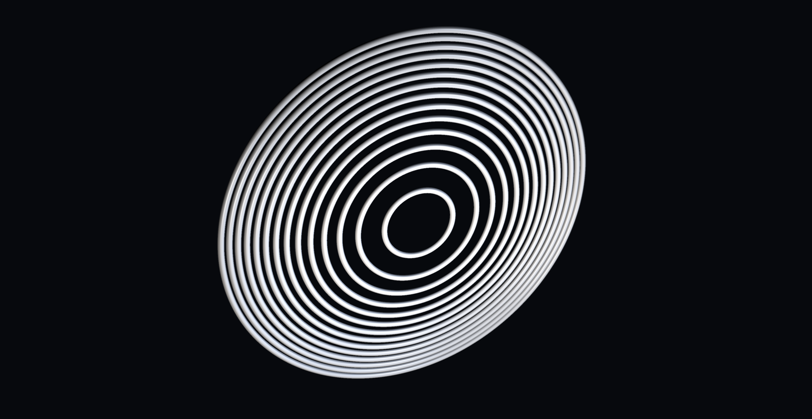
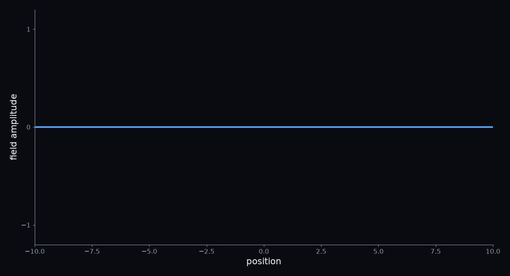
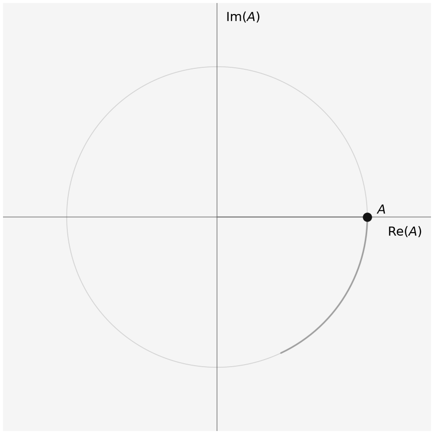
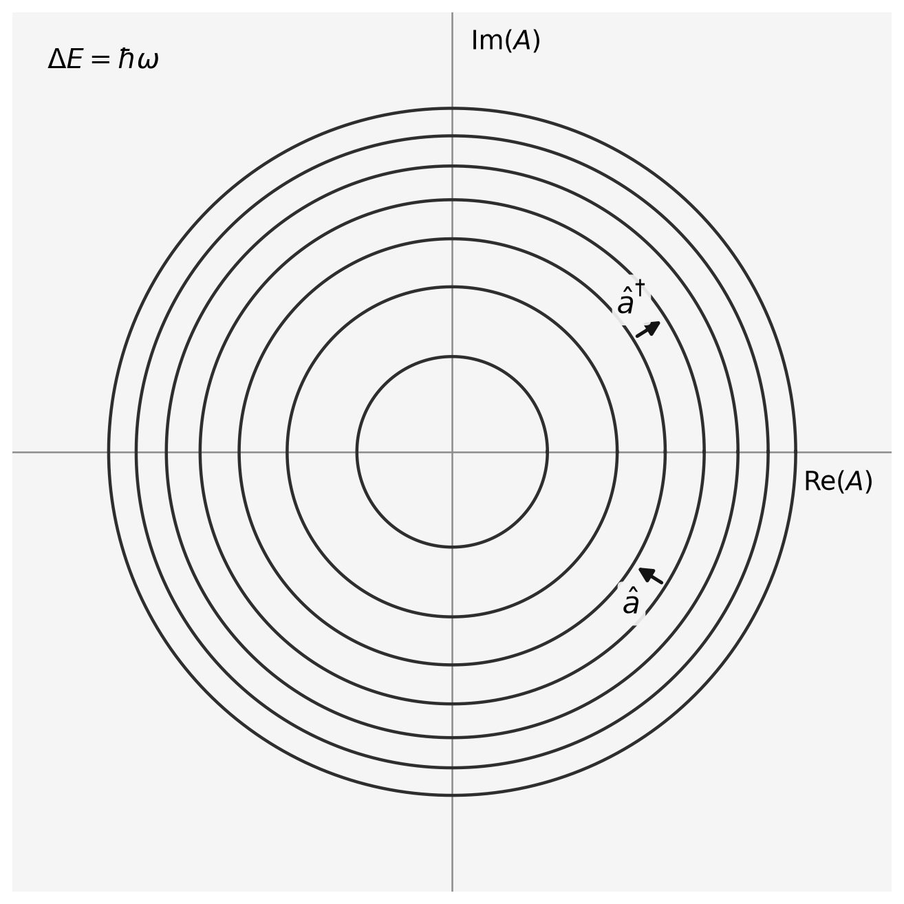
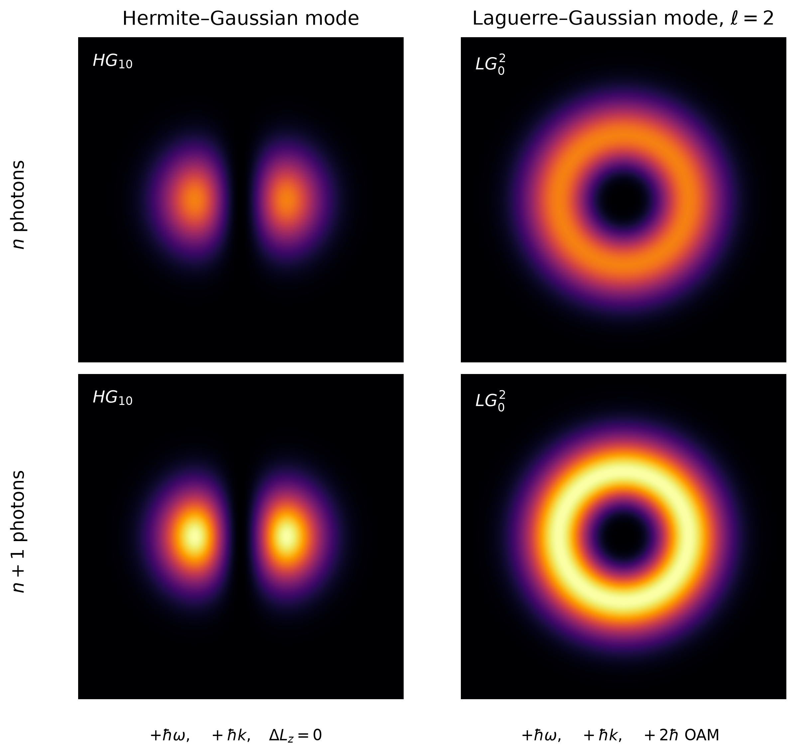

# What Is a Photon, Really?

*Classical light is already surprisingly particle-like. So what does quantization actually add?*

> Caption: **The plane of a mode's complex amplitude. Classically, the mode can sit at any distance from the center. Quantum mechanically, only certain energies are allowed, and each ring marks one of them.**
> Alt text: A set of concentric white rings, drawn like thin glossy tubes and seen at an angle so they appear as tilted ellipses against a near-black background. The innermost rings are widely spaced; toward the outer edge the rings crowd closer and closer together.
> Source: Image by author.

## A Wave Packet Is Still Just a Classical Wave

A monochromatic wave stretches through all of space. But add several waves with slightly different wavelengths and something interesting happens. Near one place their peaks line up and reinforce each other; farther away they drift out of step and cancel. The result is a localized wave packet: a little bundle of waves travelling through space. It is tempting to look at that bundle and think: *there is the photon*. But everything in Figure 1 is ordinary classical wave physics. No quantum mechanics is needed to make light localized. A narrower packet simply requires a broader spread of wavelengths. 

> **Localization does not make light into photons.**

> Caption: **Figure 1. A localized pulse is still a classical wave. Waves with slightly different wavelengths reinforce near the center of the packet and cancel farther away. Nothing here is quantum: localization comes from classical superposition.**
> Alt text: Animation on a dark background with axes labelled position and field amplitude. A blue oscillating wave packet, strongest at its center and fading to zero on either side, travels from left to right across the plot, bounded by a smooth gray envelope.
> Source: Image by author.

## Even Momentum Does Not Make It a Photon

Light is more than a propagating wave. It also carries energy and momentum. When light is absorbed or reflected, that momentum can be transferred to matter, producing a tiny force known as radiation pressure. None of this requires us to think of light as particles; it follows directly from classical physics.

And light can carry angular momentum too. The twisted modes from the previous post are an example. Their helical phase structure gives the field orbital angular momentum, which can even be transferred to matter and make microscopic objects rotate.

If classical light can already be localized and carry momentum and angular momentum, then what, exactly, is the particle-like ingredient that quantization adds?

## One Mode, One Complex Number

Before we quantize light, let's strip it down to the simplest thing we can quantize: a single mode with fixed, linear polarization¹. A mode can have a simple shape or a complicated one. For example, the Gaussian beam from the previous post had a spatial shape of the form

$$
u(x,z)=\frac{1}{\sqrt{w(z)}}
e^{-x^2/w(z)^2}
e^{ikx^2/2R(z)}
e^{-i\psi(z)/2}.
$$

The precise shape is not important here. Other modes can have several lobes, a ring, or a twisting phase. The important point is that once we have chosen one particular mode, all of that spatial structure is fixed. We can collect it into a single function *u(x,z)*.

What remains free is how strongly that mode is excited and its phase. We package those into one complex number *A(t)*. The real electric field can then be written schematically as

$$
E(x,z,t)
\propto
A(t)u(x,z)
+
A^*(t)u^*(x,z).
$$

All the spatial structure sits in *u(x,z)*; all the time dependence sits in *A(t)*. For a mode with a single frequency ω, *A(t)* simply rotates in the complex plane at that frequency.

Figure 2 gives this a simple geometric picture: *A* is a point in a plane. Its distance from the center tells us how strong the field is, while its angle tells us the phase. As time passes, the point rotates around the center, and its horizontal coordinate traces the familiar oscillating electric field.

The energy of the field is obtained by integrating its energy density over space. We do not need to keep track of the magnetic contribution separately here; for a light wave it contributes an equal amount and can be absorbed into our normalization. Schematically,

$$
H\propto\int E^2\,dV.
$$

Substituting our single-mode field produces four terms. Two oscillate at twice the optical frequency and average to zero over a cycle. The remaining two contain the same spatial integral and leave us with

$$
H=\frac{\omega}{2}\left(A^*A+AA^*\right),
$$

where we have chosen the normalization of *A* so that the constant in front is ω/2.

Classically, *A* and *A*\* are ordinary complex numbers. It would therefore be perfectly natural to say that *A*\**A* = *AA*\* and immediately simplify this to

$$
H=\omega|A|^2.
$$

For a reason that will become important when we quantize the field, however, we will **not** take that last step. We will keep the two terms in the order in which they naturally appeared:

$$
H=\frac{\omega}{2}\left(A^*A+AA^*\right).
$$

Most importantly, in the classical picture *A* always has a definite value. At every moment the field has a definite amplitude and phase, and there is no restriction on what that value can be: *A* can be any point in the plane. Because |*A*|² can never be negative, the classical energy can vary continuously from zero upward. At *A* = 0 there is no field and no energy.

That is the classical picture we are about to quantize.

> Caption: **Figure 2. The plane of the complex amplitude *A*. A classical mode is a single point in this plane. As time passes, the point circles the center at frequency ω, and its horizontal coordinate is the oscillating electric field. The circle drawn is just one possibility: the point could circle at any radius, so the energy ω|*A*|² can take any value.**
> Alt text: Animation on a light background with horizontal axis Re(A) and vertical axis Im(A). A black dot labelled A moves around a faint circle centered on the origin, trailed by a short gray arc. A dark segment along the horizontal axis runs from the origin to the dot's horizontal position.
> Source: Image by author.

## Now Quantize the Field

To quantize a classical system, we start from its Hamiltonian — the expression for its energy — and replace its classical variables by operators.

For our single mode, we deliberately kept the classical Hamiltonian in the form in which it arose from the field:

$$
H=\frac{\omega}{2}\left(A^*A+AA^*\right).
$$

Now comes the crucial step. We promote *A* and *A*\* from ordinary numbers to operators,  and †. Operators act on quantum states, and unlike ordinary numbers, their order can matter. Applying  first and † second need not give the same result as applying them in the opposite order. 

The difference between those two orders is written using a **commutator**:

$$
[\hat A,\hat A^\dagger]
=
\hat A\hat A^\dagger-\hat A^\dagger\hat A.
$$

For our electromagnetic mode, quantization means imposing

$$
[\hat A,\hat A^\dagger]=\hbar.
$$

> **This is where the quantization happens. We have replaced two classical quantities that commute with two quantum operators that do not. The difference made by changing their order is set by the fundamental quantum constant: Planck's constant ℏ.**

The quantum Hamiltonian now becomes

$$
\hat H=\frac{1}{2}\omega(\hat A^\dagger\hat A+\hat A\hat A^\dagger).
$$

From the commutator,

$$
\hat A\hat A^\dagger
=
\hat A^\dagger\hat A+\hbar,
$$

so we can rewrite the Hamiltonian as

$$
\hat H
=
\omega\hat A^\dagger\hat A
+
\frac{1}{2}\hbar\omega.
$$

Something fundamental has changed. Just as |*A*|² could never be negative in the classical theory, † cannot give a negative contribution to the energy. But now there is an extra term that cannot disappear: ½ℏω.

So the energy is bounded below by ½ℏω. Even the lowest-energy state of the mode cannot have zero energy.

But we have not yet found the rest of the allowed energies. For that, we need to look more closely at what  and † actually do.

## Raising and Lowering the Energy

It is convenient to absorb ℏ into the definition of the operators:

$$
\hat a=\frac{\hat A}{\sqrt{\hbar}},
\qquad
\hat a^\dagger=\frac{\hat A^\dagger}{\sqrt{\hbar}}.
$$

Then

$$
[\hat a,\hat a^\dagger]=1
$$

and the Hamiltonian becomes

$$
\hat H=\hbar\omega\left(\hat a^\dagger\hat a+\frac{1}{2}\right).
$$

Now, what exactly is the meaning of these operators â and â†? We will see that they play a very intuitive role. The Hamiltonian contains the combination â†â. Think of its value as telling us how far up the energy scale the mode sits. Our commutator tells us that reversing the order adds exactly one:

$$
\hat a\hat a^\dagger
=
\hat a^\dagger\hat a+1.
$$

One can show from this relation that applying ↠raises the value of â†â by one, while applying â lowers it by one. Because each unit in the Hamiltonian is multiplied by ℏω, applying â lowers the energy by ℏω and applying ↠raises it by ℏω. That is why these operators are called the **lowering** and **raising** operators.

> **Applying the lowering and raising operators takes the energy in a mode through a ladder, with a distance ℏω between the steps.**

But where does the ladder begin? Call the lowest value *n₀* and its state |*n₀*⟩. Because it is the lowest state, applying the lowering operator must give zero; otherwise it would produce another state one rung below:

$$
\hat a|n_0\rangle=0.
$$

Now take the squared length of that lowered state:

$$
\|\hat a|n_0\rangle\|^2
=
\langle n_0|\hat a^\dagger\hat a|n_0\rangle
=
n_0.
$$

The left-hand side is zero, so *n₀* must be zero. The ladder therefore begins at *n* = 0. Applying ↠repeatedly then generates

$$
n=0,1,2,3,\ldots
$$

and the allowed energies are

$$
E_n=\left(n+\frac{1}{2}\right)\hbar\omega.
$$

with *n* equal to zero, or a positive integer.

And now, finally, we can introduce the word **photon**. For an electromagnetic mode, one quantum of excitation — one step up this ladder — is what we call a photon. The operators â and ↠are therefore also called the **annihilation** and **creation** operators: they remove or add one photon to the mode.

A photon is not something we put into the theory at the beginning. It is what one quantum of excitation of the electromagnetic field turns out to be.

> Caption: **Figure 3. After quantization, the mode can only have energies Eₙ = (*n* + ½)ℏω, with *n* = 0, 1, 2, … Each ring marks one of these energies, starting from ½ℏω at the innermost ring. The raising operator ↠moves the mode one ring outward and the lowering operator â one ring inward, each step changing the energy by ℏω. Because energy grows with the square of the distance from the center, equal steps in energy bring the rings closer together farther out. The rings are not orbits: a state with a definite number of quanta has no definite phase, so there is no point travelling around a ring.**
> Alt text: Seven concentric black rings centered on the origin of axes labelled Re(A) and Im(A), on a light background. The gaps between neighbouring rings shrink toward the outside. A short arrow labelled ↠points outward from one ring to the next, and a short arrow labelled â points inward. The label ΔE = ℏω appears in the top left corner.
> Source: Image by author.

## What One Quantum Carries

We can now return to the properties of light we started with: energy, momentum and angular momentum.

Classically, these are properties of the electromagnetic mode itself. A travelling mode has a frequency ω and a wave number *k*. A twisted mode also has an azimuthal index ℓ, which tells us how many times its phase winds around the axis.

Quantization does not create these properties. It tells us how they come in discrete amounts. Each additional excitation of the mode adds one quantum of everything it carries:

**energy: ℏω**

**momentum: ℏ*k***

**orbital angular momentum: ℓℏ**

For a travelling light mode, *k* = ω/*c*, so the energy step ℏω corresponds to the momentum step ℏ*k*. For the vortex beams from the previous post — Laguerre–Gaussian modes — the phase winds ℓ times around the axis, and one excitation carries orbital angular momentum ℓℏ.
If we populate that beam with *n* photons, it carries energy *n*ℏω and orbital angular momentum *n*ℓℏ. Here both *n* and ℓ are integers, but their origins are radically different. Already in the classical view, ℓ is an integer because the phase can only change by multiples of 2π when fully circling the beam axis. In the quantum formalism, *n* is confined to integer values and represents the energy ladder shown in Figure 3. The mathematics looks similar, but the meaning is different.

There is an important difference between energy and the other two quantities. Energy is always positive, so the zero-point contributions add: even the vacuum retains the ½ℏω term for each mode. Momentum and angular momentum can have either sign. The vacuum contains opposite modes symmetrically — +*k* and −*k*, or +ℓ and −ℓ — so their contributions cancel. The vacuum therefore has no net momentum or orbital angular momentum.

So a photon does not acquire its momentum or angular momentum because it is a tiny particle flying along a particular trajectory. Those quantities are already encoded in the mode. A photon is one quantum of excitation of that mode, and therefore carries one quantum's share of its energy, momentum and angular momentum.

The twist belongs to the wave. The quantization tells us how much comes with each excitation.

> Caption: **Figure 4. Two mode shapes from the previous post, a Hermite–Gaussian mode and a Laguerre–Gaussian vortex mode with ℓ = 2, each shown with *n* and with *n* + 1 photons. Adding a photon makes the pattern brighter but leaves its shape unchanged. In both modes the extra photon adds energy ℏω and momentum ℏk; only in the twisted mode does it also add orbital angular momentum, 2ℏ. The indices on HG₁₀ and LG₀² label the shape of the mode, not the number of photons.**
> Alt text: A two-by-two grid of intensity patterns on black backgrounds. The left column, headed Hermite–Gaussian mode and labelled HG₁₀, shows two side-by-side bright lobes. The right column, headed Laguerre–Gaussian mode, ℓ = 2, and labelled LG₀², shows a bright ring with a dark center. The top row is labelled n photons and the bottom row n + 1 photons; the bottom patterns have the same shapes but are brighter. Below the columns are the labels +ℏω, +ℏk, 0 OAM for the left mode and +ℏω, +ℏk, +2ℏ OAM for the right.
> Source: Image by author.

## A Photon Is Not a Tiny Wave Packet

So, adding a photon to a mode means we increase the energy, momentum and angular momentum of that mode by specific amounts, much as if we had added one particle to a stream of particles. Does that mean we now know where the photon is?

The point is that this question mixes up two different ideas: **the shape of the mode and the number of quanta in it.**

A mode can extend over a large region of space, or we can combine frequencies to make a localized pulse. That determines the shape of the electromagnetic field. Quantization does something different. It tells us whether that mode contains zero, one, two, or many quanta of excitation.

These two properties are independent. A localized pulse can contain many photons, but it can also contain just one. And a single photon does not have to look like a tiny point or a little ball of light. Its spatial structure is determined by the mode it occupies.

> **localization belongs to the mode; photon number belongs to its excitation.**

So perhaps the most useful picture of a photon is not a tiny wave packet travelling through space. A photon is **one quantum of excitation of an electromagnetic mode**. The wave tells us its shape. Quantization tells us how many.

## A Click Does Not Prove a Photon

Quantization changes the question we ask about a mode. It is no longer how much energy the mode contains, but how many excitations. That is the particle-like ingredient classical light was missing.

Can we see that count directly? The obvious place to look is a detector. Very weak light does not build up a signal smoothly. It produces separate clicks, and it is tempting to count each click as one photon arriving.

But a click does not prove that. Treat the light as a classical wave and only the detector quantum mechanically, and the clicks still appear. They come at random times, at a rate set by the intensity of the light. The discreteness can come from the detector rather than from the light. Even the photoelectric effect, the historical argument for photons, can be explained this way.

So one mode watched by one detector gives us surprisingly little evidence of the quantum nature of light. Where does this quantum nature show up? When several modes are involved, and we ask how their excitations are related. We can study what happens when we combine two modes that are both excited, and we can look at quantum correlations between modes, such as entanglement.

We save that for the next post.

¹The article considers linearly polarized light. If we include the option of circular polarization we would need to include an additional ('spin') angular momentum of +ℏ or -ℏ.